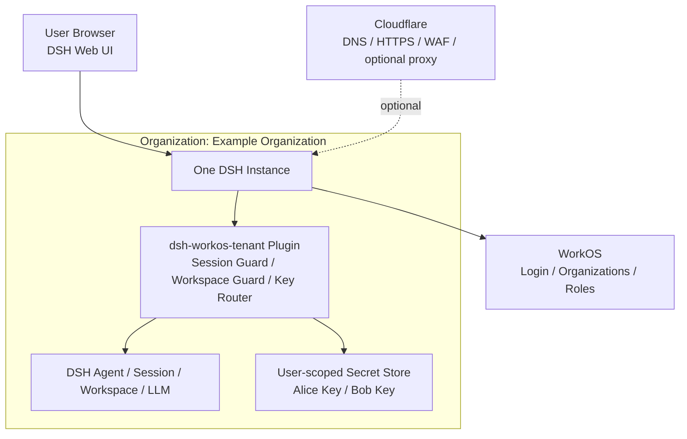
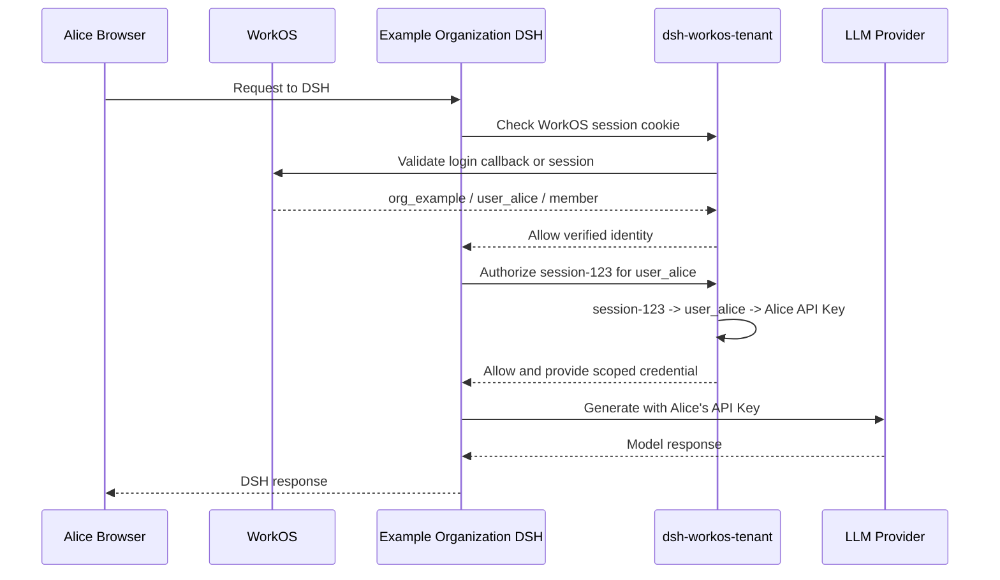

# dsh-workos-tenant

[中文说明](README.zh-CN.md)

`dsh-workos-tenant` is a DSH plugin for the target topology:

- one DSH instance per organization;
- multiple WorkOS-authenticated users inside that organization;
- user-owned sessions and workspaces;
- user-scoped LLM API keys selected from the current session.

The plugin now contains both the WorkOS login gate and the DSH tenant policy. Cloudflare can remain outside as DNS, HTTPS, WAF, and optional Container routing.

It does not modify DeepSeek Harness source code.

## GitHub release

The project is a standalone repository named `dsh-workos-tenant`. To publish a fresh checkout to GitHub, create an empty repository with that name and connect it with:

```bash
git init -b main
git add .
git commit -m "Initial dsh-workos-tenant plugin"
git remote add origin https://github.com/<owner>/dsh-workos-tenant.git
git push -u origin main
```

Do not commit `.env`, DSH profiles, Cloudflare tokens, WorkOS keys, or tenant-state files. `.gitignore` already excludes the local secret and profile paths. A GitHub repository is enough for source distribution; publishing to npm is optional because DSH can install the package from a Git link while it is being tested.

## Architecture



This deployment model uses one DSH instance per WorkOS organization. The organization binding is configured with `WORKOS_ORGANIZATION_ID`; any outer routing or Cloudflare Container placement remains a deployment concern.



## Boundary

This package implements the DSH-side WorkOS gate, but deliberately does **not** implement:

- Cloudflare Worker, reverse proxy, DNS, or TLS;
- organization-to-container routing;
- Cloudflare Worker D1 bindings inside a Node process (D1 is accessed through the Cloudflare API);
- provider-specific secret vault integration.

The plugin owns the WorkOS authorization-code exchange, HttpOnly session cookie, login redirect, logout, and DSH route protection. It derives a trusted identity from the server-side WorkOS response:

```js
{
  organizationId: 'org_example',
  userId: 'user_alice',
  role: 'member'
}
```

The plugin then applies DSH-internal ownership and authorization rules. It must never trust `organizationId` or `userId` directly from an unverified browser request.

## What is implemented

- Standard DSH bundle metadata through `dsh.bundle.patch`.
- Cordis services exposed as `ctx.tenantPolicy` and `ctx.workosAuth` when WorkOS is enabled.
- WorkOS AuthKit `/auth/login`, `/auth/callback`, `/auth/logout`, and `/auth/me` routes.
- Signed-in user or email and organization details in the sidebar, with a sign-out menu.
- Admin-only WorkOS tenant settings under DSH Settings > Plugins > WorkOS tenant.
- Role-based settings visibility: members can manage only their own Models page; owner/admin roles manage tenant settings.
- Per-user model provider and credential namespaces, with shared unprefixed providers available to the organization.
- Server-side authorization-code exchange and HttpOnly, signed session cookies.
- Automatic redirect of unauthenticated index requests to `/auth/login`.
- WorkOS authentication required for DSH `/api` and upgrade requests.
- Verified identity access through `ctx.workosAuth.identityFromRequest()` and `runWithRequestIdentity()`.
- Organization and user identity normalization.
- Organization and user ownership for sessions and workspaces.
- Organization-admin access to users in the same organization only.
- User-scoped API key storage and owner-derived session-key routing interfaces.
- Automatic Session/Workspace Remote guards when WorkOS authentication is enabled.
- Pure Session/Workspace controller Guards for direct integrations and tests.
- API key descriptions that never return the secret value.
- Session disposal cleanup through DSH's `session/disposed` event.
- Local JSON persistence when no D1 configuration is present.
- Cloudflare D1 REST persistence when configured, with encrypted state payloads.
- Pure Node tests for the policy and storage boundary.

The policy keeps an in-memory cache for synchronous DSH controller and LLM calls, then writes changes through the selected storage adapter. D1 writes are serialized; deploy multiple DSH replicas only after adding a stronger concurrency strategy.

## Local test

```bash
npm test
```

## Install into a DSH profile

From a DSH profile directory:

```bash
dsh plugin --profile web add "link:/Users/silverwing/git/dsh-enterprise"
```

The first boot must have the WorkOS environment variables available so AuthKit can create the initial session. Start from [`.env.example`](./.env.example) or export them directly:

```bash
cp .env.example .env
# edit .env, then load it into the DSH process
set -a; . ./.env; set +a

export WORKOS_API_KEY="sk_..."
export WORKOS_CLIENT_ID="client_..."
export WORKOS_ORGANIZATION_ID="org_..."
export WORKOS_REDIRECT_URI="http://127.0.0.1:3080/auth/callback"
export WORKOS_COOKIE_SECRET="at-least-32-random-characters"
```

`WORKOS_ORGANIZATION_ID` binds this DSH instance to exactly one WorkOS organization. `WORKOS_COOKIE_SECRET` signs the local HttpOnly session cookie. It is not sent to WorkOS or the browser.

After signing in, an owner or admin can open **Settings > Plugins > WorkOS tenant** and manage the connection, storage, and access policy. Secrets are write-only in the form and are stored in an encrypted tenant configuration file under `$DSH_HOME` (`workos-tenant-config.json` plus its private key file). Access-policy changes apply immediately; WorkOS connection and storage changes apply after restarting DSH. Keep the initial environment variables until the managed configuration has been saved and a restart has succeeded.

The **Allow other devices on the network to access DSH** switch is off by default. Turn it on to bind the Web server to `0.0.0.0`; after restarting, DSH prints a LAN URL such as `http://172.20.5.172:3080/?token=...`. The browser Host/Origin fence trusts the detected LAN IPv4 addresses, while WorkOS authentication still applies. Restrict the port with the machine or network firewall.

When network access is enabled, the AuthKit callback follows the host used to open DSH so the OAuth state cookie remains on the same origin. Register every exact callback URL that users may use in the WorkOS dashboard, for example `http://127.0.0.1:3080/auth/callback`, `http://172.20.5.172:3080/auth/callback`, and `https://dsh.example.com/auth/callback`. Add each matching root URL, such as `http://172.20.5.172:3080/`, to the WorkOS Sign-out URIs as well. WorkOS staging environments accept HTTP LAN callbacks; production Web applications require an HTTPS domain (with a loopback exception for native clients). The configured redirect URI remains the fallback for local access and invalid request hosts.

The plugin also enables authenticated Settings RPCs for non-loopback browsers, because DSH otherwise keeps the Settings mirror in memory and shows `settings are unavailable in this browser`. Restart DSH after upgrading so the client bundle is reloaded. Member sessions and Workspaces are filtered by the authenticated WorkOS user; `owner` and `admin` can see same-organization resources only when their role is listed in `adminRoles`.

The `adminRoles` field controls cross-user visibility. The default is `owner, admin`. Set it to an empty list (`[]`, represented by an empty field in the form) when administrators should manage configuration but must not inspect another user's sessions or workspace. `adminCanManageKeys` separately controls whether those roles may manage another user's model credentials.

Members see only the Models settings page. Providers and credentials they add are stored under a deterministic user namespace and are hidden from other users; the server also rejects cross-user reads and writes. Built-in singleton provider sections keep their shared catalog, while a member's API key remains private to that member.

## Storage configuration

Without storage settings, the plugin stores tenant state in a local JSON file under `$DSH_HOME/tenant-state.json`. You can set a custom path with `DSH_TENANT_STATE_FILE`.

To use Cloudflare D1 from the Node-based DSH process, configure the D1 REST API and an encryption key:

```bash
export DSH_TENANT_STORAGE=d1
export CLOUDFLARE_ACCOUNT_ID="..."
export CLOUDFLARE_D1_DATABASE_ID="..."
export CLOUDFLARE_API_TOKEN="..."
export DSH_TENANT_ENCRYPTION_KEY="at-least-32-random-characters"
```

The D1 API token stays server-side, and D1 state is encrypted before it is sent to Cloudflare. These values can be entered by an owner/admin on the tenant settings page; they are never returned in the configuration response.

## Local DSH test

```bash
pnpm install
export DSH_HOME="$PWD/.dsh-local"

# Install the linked plugin into the isolated web profile.
dsh plugin --profile web add "link:$PWD"

# WorkOS variables must be present before this command.
dsh --profile web --no-open --host 127.0.0.1 --port 3080
```

Open the URL printed by DSH. With WorkOS enabled, a browser request without a WorkOS session redirects to `/auth/login`, then to WorkOS AuthKit. The callback creates the signed HttpOnly cookie and returns to DSH.

For a policy-only smoke test, omit the WorkOS variables; the plugin still starts, but the WorkOS routes and gate remain disabled.

Reset the isolated profile with:

```bash
rm -rf .dsh-local
```

WorkOS's official SDK and AuthKit flow are documented at [WorkOS Node.js SDK](https://workos.com/docs/sdks/node) and [AuthKit](https://workos.com/docs/authkit).

## Current API shape

```js
import {
  TenantPolicy,
  TenantSessionGuard,
  SessionKeyRouter,
  normalizeIdentity,
} from 'dsh-workos-tenant'

const policy = new TenantPolicy({
  adminRoles: ['owner', 'admin'],
  adminCanManageKeys: false,
})
const sessionGuard = new TenantSessionGuard(policy)
const router = new SessionKeyRouter(policy)
const identity = normalizeIdentity(hostAuthenticatedIdentity)

policy.claimSession(identity, sessionId)
policy.setApiKey(identity, 'openai', apiKey)

// Called by the host's LLM adapter. The key is derived from session ownership.
const key = router.resolve({
  sessionId,
  provider: 'openai',
})

// Called around the real DSH SessionController methods.
sessionGuard.authorize(identity, { sessionId })
```

## Integration contract

When WorkOS is enabled, the plugin automatically wraps the DSH Session and Workspace Remote Controllers. List/search responses are filtered, create/fork operations claim ownership, and reads, writes, streams, and workspace mutations check the verified WorkOS identity. The exported Guards remain available for custom controllers and tests.

The deployment must still:

1. configure WorkOS AuthKit and the callback URI;
2. keep WorkOS, Cloudflare, and cookie secrets only in the DSH server environment;
3. use the selected storage adapter for tenant state;
4. resolve the LLM key from the active Session owner;
5. use `ctx.workosAuth.runWithRequestIdentity(request, callback)` for any custom request-scoped controller;
6. plan D1 concurrency and key rotation before running multiple replicas.
