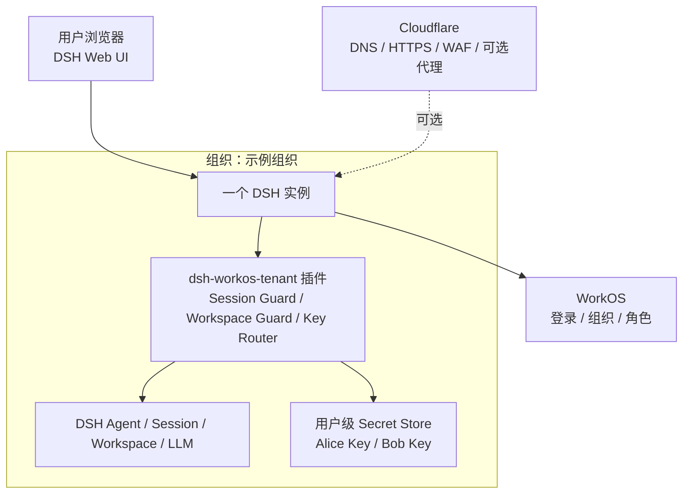
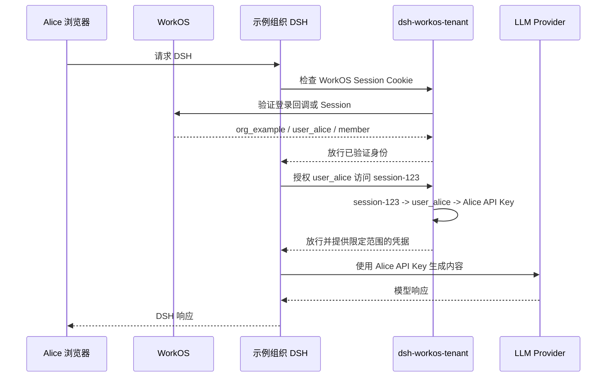

# dsh-workos-tenant

[English README](README.md)

`dsh-workos-tenant` 是一个用于以下部署模式的 DSH 插件：

- 每个组织使用一个 DSH 实例；
- 一个组织内有多个经过 WorkOS 认证的用户；
- Session 和 Workspace 按用户归属；
- 根据当前 Session 选择用户级 LLM API Key。

插件同时包含 WorkOS 登录门禁和 DSH 租户策略。Cloudflare 可以继续作为 DNS、HTTPS、WAF 和可选的 Container 路由层存在。

插件不会修改 DeepSeek Harness 源码。

## GitHub 发布

项目是一个名为 `dsh-workos-tenant` 的独立仓库。要把新的本地副本发布到 GitHub，请先创建同名空仓库，然后执行：

```bash
git init -b main
git add .
git commit -m "Initial dsh-workos-tenant plugin"
git remote add origin https://github.com/<owner>/dsh-workos-tenant.git
git push -u origin main
```

不要提交 `.env`、DSH Profile、Cloudflare Token、WorkOS Key 或租户状态文件。`.gitignore` 已经排除本地密钥和 Profile 路径。GitHub 仓库足以用于源码分发；在测试阶段不一定需要发布到 npm，因为 DSH 可以从 Git 链接安装这个包。

## 架构



这种部署模式为每个 WorkOS 组织使用一个 DSH 实例。通过 `WORKOS_ORGANIZATION_ID` 配置组织绑定；外部路由或 Cloudflare Container 的部署位置属于部署层职责。



## 边界

本包实现 DSH 侧的 WorkOS 门禁，但明确不实现：

- Cloudflare Worker、反向代理、DNS 或 TLS；
- 组织到 Container 的路由；
- Node 进程中的 Cloudflare Worker D1 binding（D1 通过 Cloudflare API 访问）；
- 针对具体 Provider 的 Secret Vault 集成。

插件负责 WorkOS 授权码交换、HttpOnly Session Cookie、登录跳转、退出登录和 DSH 路由保护。它从服务端 WorkOS 响应中提取可信身份：

```js
{
  organizationId: 'org_example',
  userId: 'user_alice',
  role: 'member'
}
```

然后插件应用 DSH 内部的归属和授权规则。插件绝不能信任未经验证的浏览器请求直接提交的 `organizationId` 或 `userId`。

## 已实现功能

- 通过 `dsh.bundle.patch` 提供标准 DSH Bundle 元数据；
- WorkOS 启用时提供 `ctx.tenantPolicy` 和 `ctx.workosAuth` Cordis 服务；
- WorkOS AuthKit 路由 `/auth/login`、`/auth/callback`、`/auth/logout` 和 `/auth/me`；
- 登录后在侧栏底部显示用户名或邮箱及组织名，并提供退出登录菜单；
- 在 DSH「设置 > 插件 > WorkOS 租户」提供仅管理员可见的租户配置页；
- 按角色控制设置可视范围：member 只能管理自己的「模型」，owner/admin 才能管理租户配置；
- Provider 和凭据按用户隔离，未加用户前缀的共享 Provider 可供组织内使用；
- 服务端授权码交换以及 HttpOnly、签名 Session Cookie；
- 未认证的首页请求自动跳转到 `/auth/login`；
- DSH `/api` 和升级请求必须通过 WorkOS 认证；
- 通过 `ctx.workosAuth.identityFromRequest()` 和 `runWithRequestIdentity()` 访问已验证身份；
- 组织和用户身份标准化；
- Session 和 Workspace 的组织及用户归属；
- 组织管理员只访问同一组织内的其他用户；
- 用户级 API Key 存储以及根据 Session 所有者路由 Key；
- 启用 WorkOS 时自动包装 Session/Workspace Remote Guard；
- 为直接集成和测试提供纯 Session/Workspace Controller Guard；
- API Key 描述接口不会返回 Secret 值；
- 通过 DSH 的 `session/disposed` 事件清理 Session 归属；
- 未配置 D1 时使用本地 JSON 持久化；
- 配置 D1 时通过 Cloudflare D1 REST API 持久化，并加密状态内容；
- 面向策略和存储边界的纯 Node 测试。

策略层保留内存缓存，以满足同步的 DSH Controller 和 LLM 调用，然后通过选定的存储适配器写入变更。D1 写入在单个进程内串行化；运行多个 DSH 副本前，需要增加更强的并发控制策略。

## 本地测试

```bash
npm test
```

## 安装到 DSH Profile

在 DSH Profile 目录中执行：

```bash
dsh plugin --profile web add "link:/Users/silverwing/git/dsh-enterprise"
```

首次启动仍需提供 WorkOS 环境变量，以便 AuthKit 建立初始 Session。可以从 [`.env.example`](./.env.example) 开始，或者直接导出环境变量：

```bash
cp .env.example .env
# 编辑 .env，然后把它加载到 DSH 进程中
set -a; . ./.env; set +a

export WORKOS_API_KEY="sk_..."
export WORKOS_CLIENT_ID="client_..."
export WORKOS_ORGANIZATION_ID="org_..."
export WORKOS_REDIRECT_URI="http://127.0.0.1:3080/auth/callback"
export WORKOS_COOKIE_SECRET="至少32个随机字符"
```

`WORKOS_ORGANIZATION_ID` 会把这个 DSH 实例绑定到一个 WorkOS 组织。`WORKOS_COOKIE_SECRET` 用于签名本地 HttpOnly Session Cookie，不会发送给 WorkOS 或浏览器。

登录后，owner 或 admin 可以打开「设置 > 插件 > WorkOS 租户」管理连接、存储和访问策略。表单中的 Secret 只写不读，会加密保存到 `$DSH_HOME` 下的租户配置文件（`workos-tenant-config.json` 及其私钥文件）。访问策略保存后立即生效；WorkOS 连接和存储变更需要重启 DSH。首次保存并成功重启前，请保留启动所需的环境变量。

「允许同一网络中的其他设备访问 DSH」默认关闭。开启后保存并重启，Web 服务会监听 `0.0.0.0`，DSH 启动日志会打印类似 `http://172.20.5.172:3080/?token=...` 的局域网地址。浏览器 Host/Origin 校验会信任检测到的局域网 IPv4 地址，WorkOS 登录仍然有效。请使用系统或网络防火墙限制端口访问范围。

`adminRoles` 控制跨用户可视范围，默认值为 `owner, admin`。如果管理员只需要管理配置而不能查看其他用户的 Session 或 Workspace，可将它设置为空数组（表单中留空）。`adminCanManageKeys` 独立控制管理员是否可以管理其他用户的模型凭据。

member 在设置中只会看到「模型」。其添加的 Provider 和凭据会写入确定性的用户命名空间，其他用户无法看到；服务端也会拒绝跨用户读写。内置单例 Provider 的共享模型目录仍由组织统一维护，但 member 输入的 API Key 只对本人有效。

## 存储配置

没有存储配置时，插件会把租户状态保存到 `$DSH_HOME/tenant-state.json`。可以通过 `DSH_TENANT_STATE_FILE` 指定自定义路径。

要从基于 Node 的 DSH 进程使用 Cloudflare D1，需要配置 D1 REST API 和加密密钥：

```bash
export DSH_TENANT_STORAGE=d1
export CLOUDFLARE_ACCOUNT_ID="..."
export CLOUDFLARE_D1_DATABASE_ID="..."
export CLOUDFLARE_API_TOKEN="..."
export DSH_TENANT_ENCRYPTION_KEY="至少32个随机字符"
```

D1 API Token 只留在服务端，状态数据发送到 Cloudflare 之前会先加密。owner/admin 可以在租户配置页填写这些值；配置接口不会返回 Secret。

## 本地 DSH 测试

```bash
pnpm install
export DSH_HOME="$PWD/.dsh-local"

# 把链接形式的插件安装到隔离的 web Profile。
dsh plugin --profile web add "link:$PWD"

# 执行此命令前必须设置 WorkOS 环境变量。
dsh --profile web --no-open --host 127.0.0.1 --port 3080
```

打开 DSH 打印出的 URL。启用 WorkOS 后，没有 WorkOS Session 的浏览器请求会跳转到 `/auth/login`，然后跳转到 WorkOS AuthKit。回调完成后会创建签名 HttpOnly Cookie，并返回 DSH。

只进行策略插件 Smoke Test 时，可以省略 WorkOS 环境变量；插件仍会启动，但 WorkOS 路由和门禁会保持关闭。

重置隔离 Profile：

```bash
rm -rf .dsh-local
```

WorkOS 官方 SDK 和 AuthKit 流程请参考 [WorkOS Node.js SDK](https://workos.com/docs/sdks/node) 和 [AuthKit](https://workos.com/docs/authkit)。

## 当前 API 形式

```js
import {
  TenantPolicy,
  TenantSessionGuard,
  SessionKeyRouter,
  normalizeIdentity,
} from 'dsh-workos-tenant'

const policy = new TenantPolicy({
  adminRoles: ['owner', 'admin'],
  adminCanManageKeys: false,
})
const sessionGuard = new TenantSessionGuard(policy)
const router = new SessionKeyRouter(policy)
const identity = normalizeIdentity(hostAuthenticatedIdentity)

policy.claimSession(identity, sessionId)
policy.setApiKey(identity, 'openai', apiKey)

// 由宿主的 LLM Adapter 调用。Key 根据 Session 所有者解析。
const key = router.resolve({
  sessionId,
  provider: 'openai',
})

// 在真实 DSH SessionController 方法外层调用。
sessionGuard.authorize(identity, { sessionId })
```

## 集成约定

启用 WorkOS 后，插件会自动包装 DSH 的 Session 和 Workspace Remote Controller。列表和搜索响应会被过滤，创建和 fork 操作会登记资源归属，读取、写入、流式操作和 Workspace 变更都会检查已验证的 WorkOS 身份。导出的 Guard 仍可用于自定义 Controller 和测试。

部署时仍需要：

1. 配置 WorkOS AuthKit 和回调地址；
2. 只在 DSH 服务端环境中保存 WorkOS、Cloudflare 和 Cookie Secret；
3. 使用选定的存储适配器保存租户状态；
4. 根据当前 Session 所有者解析 LLM Key；
5. 自定义请求级 Controller 使用 `ctx.workosAuth.runWithRequestIdentity(request, callback)`；
6. 运行多个副本前规划 D1 并发控制和密钥轮换。
